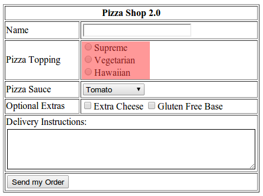
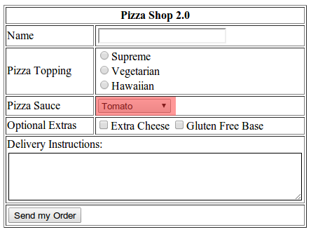
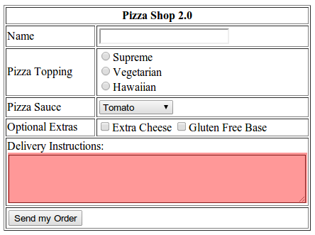

---

layout: ots
title: Forms

---

You've probably seen HTML forms a billion times already:

Ok maybe not this one specifically. It is a bit weird.

Forms start with the `<form>` tag. This marks the start of the form area, and can surrounded basically anything inside the HTML body. A form area starts like this:

	<form action="post.html" method="post">

This will send a HTTP _POST_ of the form to a page called `post.html` on the server.

Inside the `<form>` tag there are a number of different `<input>` tags available:

## Text input

The text input element allows people to type in one line of text. The input type is `text`.

	<input type="text" name="name"></input>

This will send the contents of the text box back to the server with the variable `name`.

## Radio buttons

Radio buttons allow users to select one option from many. They are named from the preset buttons on car radios.

To create some radio buttons you use the input type `radio`:

	<input type="radio" name="sex" value="male">Male</input>
	<input type="radio" name="sex" value="female">Female</input>

Here we can see that each `<input>` has a type of `radio` and _the same name_. It is imperative that each radio input has the same name. The selected radio option will be sent back to the server with variable `sex`. The value of that variable will be either `male` or `female`.

## Select dropdown

Select input is a little trickier. The `<select>` tag groups a list of `<option>` tags. Like this:

	 <select name="eyecolor">
      <option value="blue">Blue</option>
      <option value="brown">Brown</option>
      <option value="green">Green</option>
      <option value="other">Other</option>
     </select>

When sent back to the server the browser will use the variable name `eyecolor` and the value of the selected option.

There are a couple of gotchas with select boxes:

* There is no built-in way to say "Select an option..." when the user has not selected an option yet. Although this is a very common scenario, and the browser automatically selects the first option which may be confusing. In HTML you have to specifically create a `<option>` tag containing "Select an option...".
* To automatically select an option when the page loads you can use the `selected` attribute on the option, like this:

	<option selected="selected" value="blue">Blue</option>

* There is an attribute called `multiple` which allows multiple selections in the `<select>` tag. The only reason I mention this is recommend **never** using it.

## Checkbox

A checkbox allows simple yes/no style answers for forms. They can be a little tricky because there are two ways to use them.

The first is simply to create a different name for each option:

	<input type="checkbox" name="height" value="1">Over 6 feet tall</input>
	<input type="checkbox" name="weight" value="1">Over 200 pounds</input>

When both are selected this will send back _two_ variables, `height` and `weight`. Each variable will have the value `1`.

The second is to use one name for each option:

	<input type="checkbox" name="stature" value="over6feet">Over 6 feet tall</input>
	<input type="checkbox" name="stature" value="over200pounds">Over 200 pounds</input>

When both are selected this will send back _one_ variable, `stature`, with the value `over6feet,over200pounds`. It is up to the server to split the value back into two separate items.

## Textarea

When you want more than a single line of text from a user you can use the `<textarea>` tag:

	<textarea name="athletic" cols="50" rows="4"></textarea>

It even has the archaic `cols` and `rows` attributes, which hark back to the days of green-screen text terminals. These attributes decide the size of the textarea, but generally you should just use CSS.

## Submit button

To get everything back to the server you need a submit button:

	<input type="submit" value="Enter my information">

When clicked the browser knows it is time to submit the form data back to the server. The browser gathers all the data in the `<input>`, `<select>` and `<textarea>` tags and sends them to the URL mentioned in the action element of the `<form>` tag.

# From static to dynamic

This ability to request and capture content from users is what changes a website from static to dynamic. Just about anyone can write static content and have it hosted by a webserver. But to accept data from users through `<form>` (or the more complicated JavaScript `XMLHttpRequest`), process it and store the result marks the shift from being an page author to a programmer.

Now it is time to make our website a little more interactive. Move on to the next chapter to see how we'll use `<form>` to collect some email addresses.