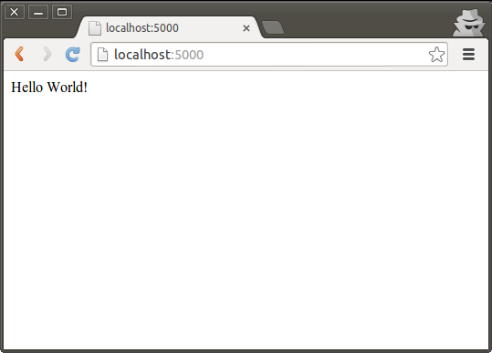

---

layout: ots
title: Hello World

---

Now that we have Python and Flask installed it's time to start with our first website. But first it helps to know a little about how your web browser retrieves web pages from a web server.

# HTTP

The HyperText Transfer Protocol is what your browser speaks to talk to a web server. In HTTP, the browser will make a _request_ and the server sends back a _response_.

There are two main types of request, `GET` and `POST`.

* The browser sends a `GET` request to retrieve data. For example, going to `http://www.opentechschool.org/team.html` will cause the browser to send `GET /team.html` to OpenTechSchool's server.
* The `POST` request is used to send data. For example if you fill out a web form and click _Submit_ it will usually send the form data back to the server through a POST.

We will be handling both GET and POST requests today in our app! First we'll handle a GET request with the Hello World example. Then in a later chapter we will try using POSTs to receive an email address.

# Hello World - A Static Website

In the early days people would write HTML files in a directory being watched by an Apache server. It was simple, but limiting. The content was _static_, with no way to make it change without editing the files on the server. Today we are going to start with something just as simple. This is the [Quickstart example](http://flask.pocoo.org/docs/quickstart/) from the Flask documentation.

Open a new file called `catseverywhere.py` in your workshop directory. This might look a little cryptic:

    from flask import Flask
    app = Flask(__name__)

    @app.route('/')
    def hello_world():
        return 'Hello World!'

    if __name__ == '__main__':
        app.debug = True        
        app.run()

Let's type it into our new file, and break it down a little:

    from flask import Flask
    app = Flask(__name__)

This imports the Flask library and creates a new website in a variable called `app`.

    @app.route('/')
    def hello_world():
        return 'Hello World!'

The `@` is new, it's called a [_decorator_](http://en.wikipedia.org/wiki/Python_syntax_and_semantics#Decorators) and it is used to 'augment' function definitions. Flask uses `route()` to say that if the browser requests the address `/` (the default, or home address), then our app should _route_ that request to this `hello_world` function.

The function itself returns the string "Hello World!". This will be sent to the web browser.

    if __name__ == '__main__':
        app.debug = True
        app.run()

This is Python for  "if this script is run directly then enable debug mode and start the application".

Now you can start running your first website! In your terminal:

	$ python catseverywhere.py 
	 * Running on http://127.0.0.1:5000/

Open that address in your browser! It probably looks something like this:

Hmmm, looks a little basic. In the next section we will look at making it a little better looking.
